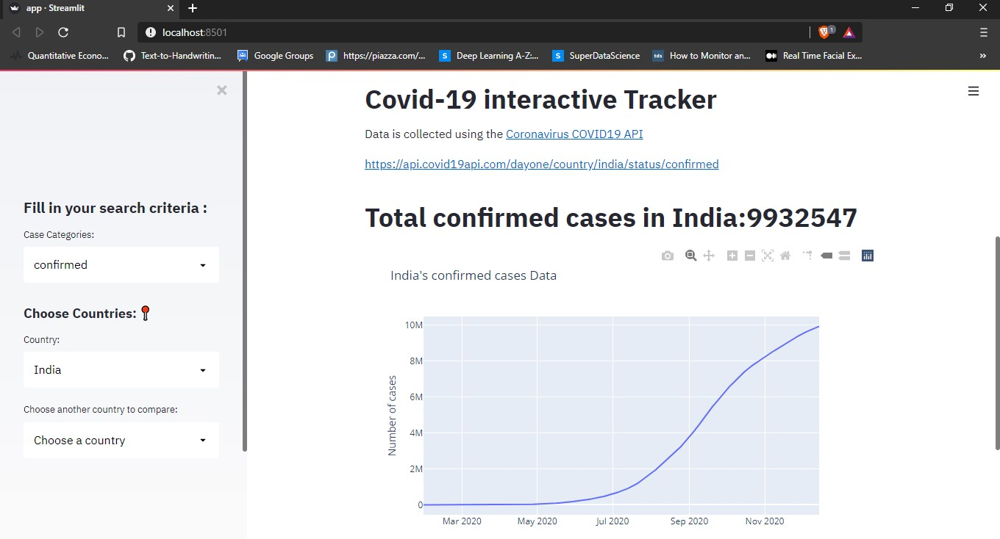

# Covid-19 Tracker Dashboard using Streamlit
## Deployed in Heroku : [Covid-19 Web App Click here](  https://covid19-streamlit-webapp.herokuapp.com/)

## Screenshots

## Instructions
1. Download relevant dependacies by : pip install requirements.txt
2. To run the web service, type streamlit run  diabetes_web_ap.py
3. Select the URL to access the web app
